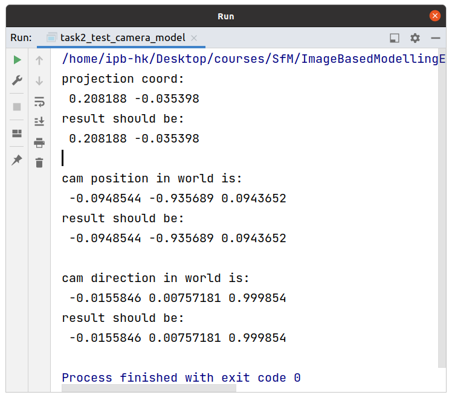

# Instruction for Homework 1

## Installation

- Download the code
  ```shell
  git clone https://github.com/KuangHaofei/ImageBasedModellingEdu.git
  cd ImageBasedModellingEdu
  git checkout hw
  ```

- Install requirements
  ```shell
  sudo apt install libjpeg-dev libtiff-dev
  ```

- Compile the source code
  ```shell
  cd ImageBasedModellingEdu
  mkdir build && cd build
  cmake ..
  make -j 8
  ```
## Task 1-1

- run the code:
  ```shell
  cd ImageBasedModellingEdu/build/examples/task1
  ./task1_test_math_basic
  ```

- outputs of the code:<br/>
  

## Task 1-2

- run the code:
  ```shell
  cd ImageBasedModellingEdu/build/examples/task1
  ./task2_test_camera_model
  ```

- outputs of the code:<br/>
  

## Task 1-3

- run the code:
  ```shell
  cd ImageBasedModellingEdu/build/examples/task1
  ./task3_test_fundamental_8_point
  ```

- outputs of the code:<br/>
  

## Task 1-4
- 
- run the code:
  - change the root path with the absolute path of your project directory at [line 204 of `task1-4_test_fundamental_ransac.cc`](./task1-4_test_fundamental_ransac.cc#L204) 
  - run command:
    ```shell
    cd ImageBasedModellingEdu/build/examples/task1
    ./task4_test_fundamental_ransac
    ```

- outputs of the code:<br/>
  

## Task 1-5

- run the code:
  ```shell
  cd ImageBasedModellingEdu/build/examples/task1
  ./task5_test_pose_from_fundamental
  ```

- outputs of the code:<br/>
  

## Task 1-6

- run the code:
  ```shell
  cd ImageBasedModellingEdu/build/examples/task1
  ./task6_test_feature_matching {project_path}/examples/data/kxm1.jpg {project_path}/examples/data/kxm2.jpg
  ./task6_test_feature_matching /home/ipb-hk/Desktop/courses/SfM/ImageBasedModellingEdu/examples/data/kxm1.jpg /home/ipb-hk/Desktop/courses/SfM/ImageBasedModellingEdu/examples/data/kxm2.jpg
  ```

- Results:
  - Nearest Neighbor
    - output:<br/>
      
    
    - matching results:<br/>
      
    
  - Lowe's Ratio
    - output:<br/>
      
    
    - matching results:<br/>
      