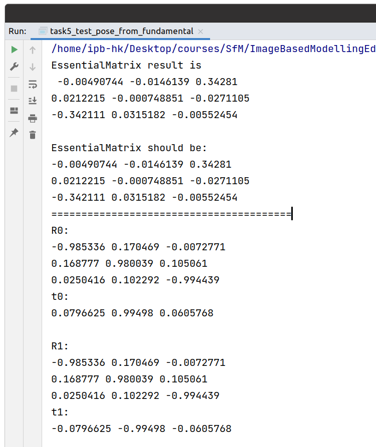
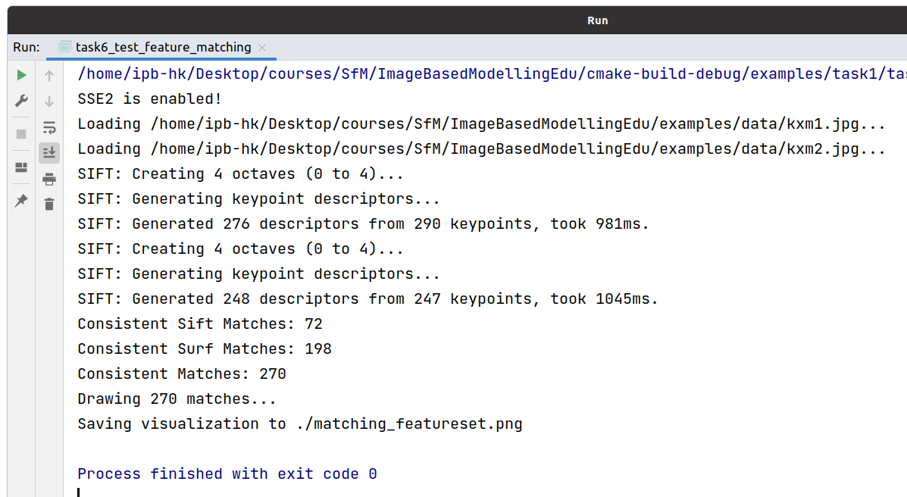

# Instruction for Homework 1

## Installation

- Download the code
  ```shell
  git clone https://github.com/KuangHaofei/ImageBasedModellingEdu.git
  cd ImageBasedModellingEdu
  git checkout hw
  ```

- Install requirements
  ```shell
  sudo apt install libjpeg-dev libtiff-dev
  ```

- Compile the source code
  ```shell
  cd ImageBasedModellingEdu
  mkdir build && cd build
  cmake ..
  make -j 8
  ```
## Task 1-1

- outputs of the code:
  

## Task 1-2

- outputs of the code:
  

## Task 1-3

- outputs of the code:
  

## Task 1-4

- outputs of the code:
  

## Task 1-5

- outputs of the code:
  

## Task 1-6

- Results:
  - Nearest Neighbor
    - output:
      
    
    - matching results:
      
    
  - Lowe's Ratio
    - output:
      
    
    - matching results:
      